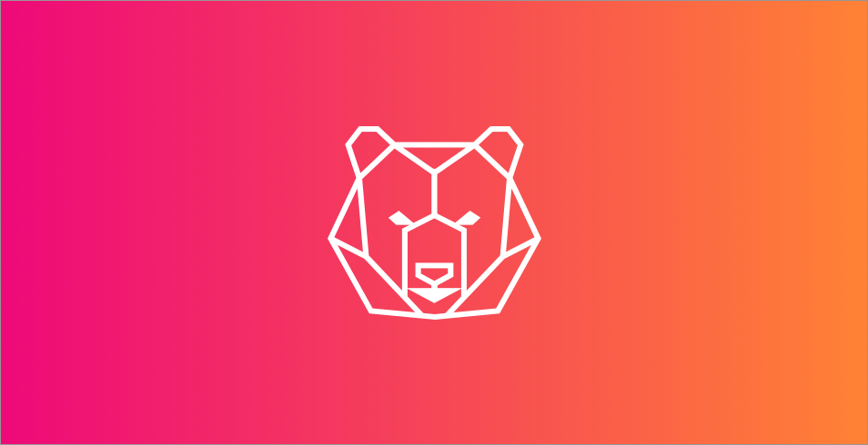

# The Bear Browser Engine Experiment
Bear is an experiment for me to learn Rust and how a browser engine really work. The goal is to create a really simple engine first and then iterate on it and implement new concepts to learn.
At the end it would be a "feature complete" browser engine in **Rust** and compiled to **WASM**
